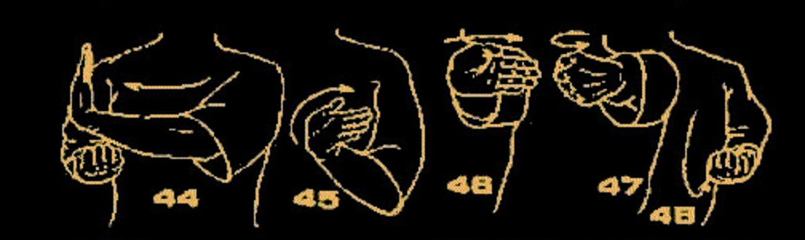
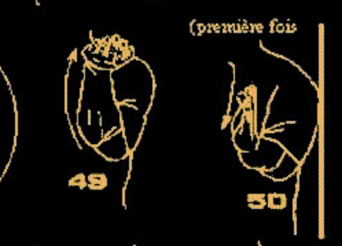
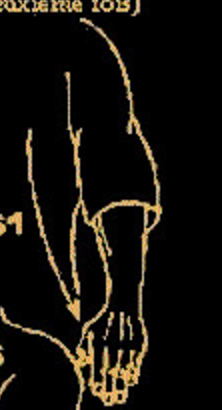
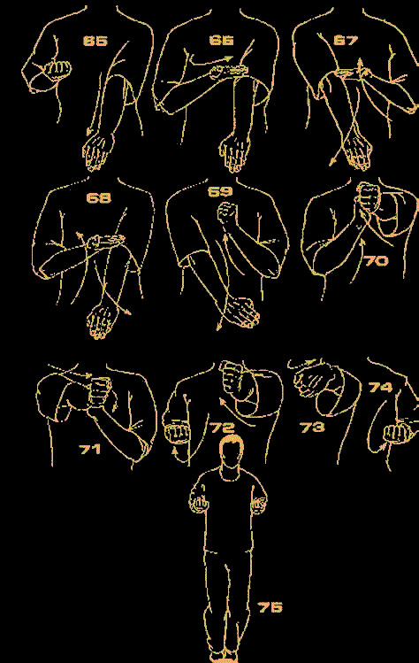

# 咏春小念头以及其变化(配合功夫图: 每天的进步都可以在图纸上体现出来)

### 1. 第一段
* 二字钳羊马的目的是, 除了腰马合一三角形力(图解: 腰和后脚跟三角形, 膝盖与地面三角形), 更是
平衡发展双手

* 摊手: (图解) 肘底发力沿着中线而出, 停到与身体一拳距离在中线位置, 发力向前整体的力, 对方较劲时一离开,摊手是向前方去的(图解:其他方向是错的), 所以能一直不离中线
* 拍手变化运用: 向前和向对方中线拍手, 练习左右拍手(拍摊伏拉护)

### 2. 第二段

#### 枕手(37)变摊手，摊手变伏手(38与39之间差一个伏手)，然后窒标，下抚手 ，上拱手，收回
* 窒标变化运用: 一个手攻防两个手, 先窒同侧后标异侧

### 3. 第三段

#### 结尾都是摊手-圈手-收

#### 摊手枕手摊手, 圈手斜掌, 摊-圈-收 (与下面的只是枕手与耕手的不同)
* 枕手是肘底力拉回, 对方是很难打破你的三角形结构,进入你的中线的

#### 摊手耕手摊手, 圈手斜掌, 摊-圈-收

#### 膀手摊手反掌, 摊-圈-收
* 膀手是从腰部发力,滚动向前, 前臂钝角向前, 手指指向对方中线
* 变化练习图解: 转马膀手一手护手

#### 最后

### 单黐手
* 黐而不离手,是整体的发力,让对方不知道你哪里硬虚软实

