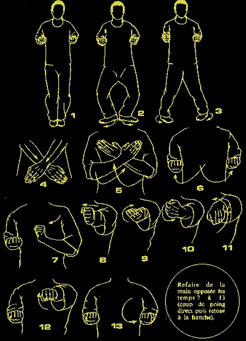

# 咏春小念头以及其变化

### 1. 第一段

### 2. 第二段

#### 枕手(37)变摊手，摊手变伏手(38与39之间差一个伏手)，然后窒标，下抚手 ，上拱手，收回

### 2. 第三段

#### 结尾都是摊手-圈手-收

#### 摊手枕手摊手, 圈手斜掌, 摊-圈-收 (与下面的只是枕手与耕手的不同)

#### 摊手耕手摊手, 圈手斜掌, 摊-圈-收

#### 膀手摊手反掌, 摊-圈-收

#### 最后

