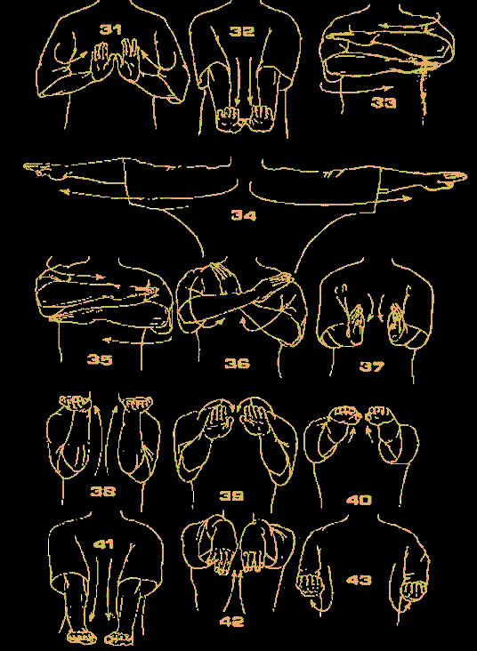
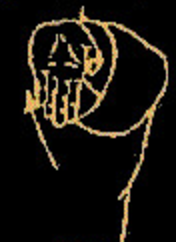

# 咏春小念头以及其变化(配合功夫图: 每天的进步都可以在图纸上体现出来)

- [咏春小念头以及其变化(配合功夫图: 每天的进步都可以在图纸上体现出来)](#%E5%92%8F%E6%98%A5%E5%B0%8F%E5%BF%B5%E5%A4%B4%E4%BB%A5%E5%8F%8A%E5%85%B6%E5%8F%98%E5%8C%96%E9%85%8D%E5%90%88%E5%8A%9F%E5%A4%AB%E5%9B%BE-%E6%AF%8F%E5%A4%A9%E7%9A%84%E8%BF%9B%E6%AD%A5%E9%83%BD%E5%8F%AF%E4%BB%A5%E5%9C%A8%E5%9B%BE%E7%BA%B8%E4%B8%8A%E4%BD%93%E7%8E%B0%E5%87%BA%E6%9D%A5)
    - [1. 第一段](#1-%E7%AC%AC%E4%B8%80%E6%AE%B5)
    - [2. 第二段](#2-%E7%AC%AC%E4%BA%8C%E6%AE%B5)
      - [枕手(37)变摊手，摊手变伏手(38与39之间差一个伏手)，然后窒标，下抚手 ，上拱手，收回](#%E6%9E%95%E6%89%8B37%E5%8F%98%E6%91%8A%E6%89%8B%E6%91%8A%E6%89%8B%E5%8F%98%E4%BC%8F%E6%89%8B38%E4%B8%8E39%E4%B9%8B%E9%97%B4%E5%B7%AE%E4%B8%80%E4%B8%AA%E4%BC%8F%E6%89%8B%E7%84%B6%E5%90%8E%E7%AA%92%E6%A0%87%E4%B8%8B%E6%8A%9A%E6%89%8B-%E4%B8%8A%E6%8B%B1%E6%89%8B%E6%94%B6%E5%9B%9E)
    - [3. 第三段](#3-%E7%AC%AC%E4%B8%89%E6%AE%B5)
      - [结尾都是摊手-圈手-收](#%E7%BB%93%E5%B0%BE%E9%83%BD%E6%98%AF%E6%91%8A%E6%89%8B-%E5%9C%88%E6%89%8B-%E6%94%B6)
      - [摊手枕手摊手, 圈手斜掌, 摊-圈-收 (与下面的只是枕手与耕手的不同)](#%E6%91%8A%E6%89%8B%E6%9E%95%E6%89%8B%E6%91%8A%E6%89%8B-%E5%9C%88%E6%89%8B%E6%96%9C%E6%8E%8C-%E6%91%8A-%E5%9C%88-%E6%94%B6-%E4%B8%8E%E4%B8%8B%E9%9D%A2%E7%9A%84%E5%8F%AA%E6%98%AF%E6%9E%95%E6%89%8B%E4%B8%8E%E8%80%95%E6%89%8B%E7%9A%84%E4%B8%8D%E5%90%8C)
      - [摊手耕手摊手, 圈手斜掌, 摊-圈-收](#%E6%91%8A%E6%89%8B%E8%80%95%E6%89%8B%E6%91%8A%E6%89%8B-%E5%9C%88%E6%89%8B%E6%96%9C%E6%8E%8C-%E6%91%8A-%E5%9C%88-%E6%94%B6)
      - [膀手摊手反掌, 摊-圈-收](#%E8%86%80%E6%89%8B%E6%91%8A%E6%89%8B%E5%8F%8D%E6%8E%8C-%E6%91%8A-%E5%9C%88-%E6%94%B6)
      - [最后](#%E6%9C%80%E5%90%8E)
    - [4. 单黐手](#4-%E5%8D%95%E9%BB%90%E6%89%8B)
    - [5. 双黐手](#5-%E5%8F%8C%E9%BB%90%E6%89%8B)

### 1. 第一段
* 二字钳羊马的目的是, 除了腰马合一三角形力(图解: 腰和后脚跟三角形, 膝盖与地面三角形), 更是
平衡发展双手

* 摊手: (图解) 肘底发力沿着中线而出, 停到与身体一拳距离在中线位置, 发力向前整体的力, 对方较劲时一离开,摊手是向前方去的(图解:其他方向是错的), 所以能一直不离中线
* 拍手变化运用: 向前和向对方中线拍手, 练习左右拍手(拍摊伏拉护)

### 2. 第二段

#### 枕手(37)变摊手，摊手变伏手(38与39之间差一个伏手)，然后窒标，下抚手 ，上拱手，收回
* 窒标变化运用: 一个手攻防两个手, 先窒同侧后标异侧

### 3. 第三段

#### 结尾都是摊手-圈手-收

#### 摊手枕手摊手, 圈手斜掌, 摊-圈-收 (与下面的只是枕手与耕手的不同)
* 枕手是肘底力拉回, 对方是很难打破你的三角形结构,进入你的中线的

#### 摊手耕手摊手, 圈手斜掌, 摊-圈-收

#### 膀手摊手反掌, 摊-圈-收
* 膀手是从腰部发力,滚动向前, 前臂钝角向前, 手指指向对方中线
* 变化练习图解: 转马膀手一手护手

#### 最后

### 4. 单黐手
* 黐而不离手,是整体的发力,让对方不知道你哪里硬虚软实

### 5. 双黐手
* 一手伏手搭住向前发力, 一手摊膀变化, 左右手交替练习
